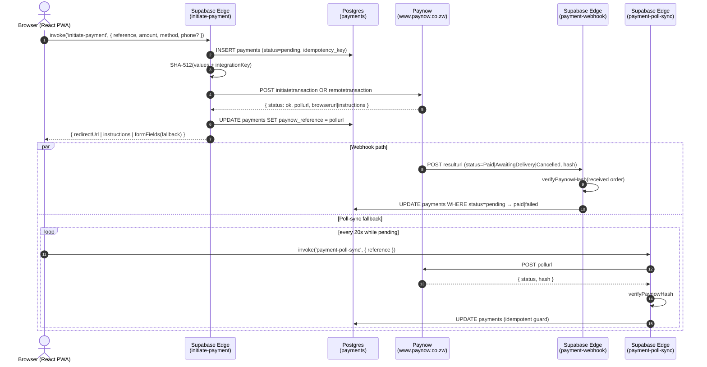
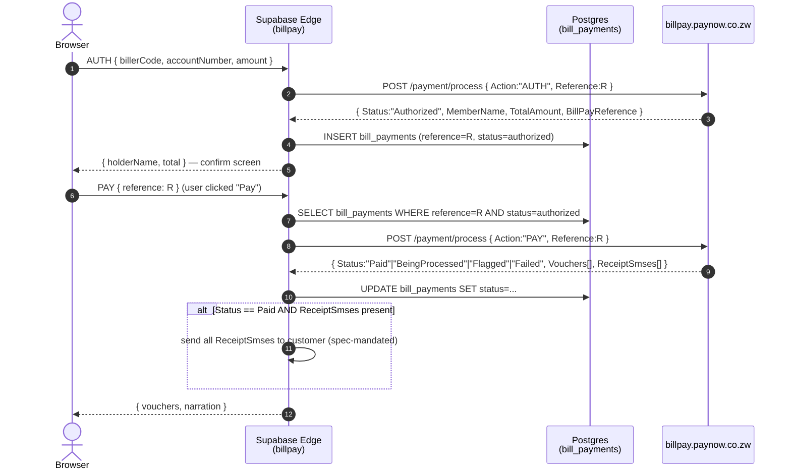

# Paynow Merchant Services × Supabase — Integration Reference

**Audience:** Paynow senior engineers / merchant integration team.
**Source repo:** ZimLivestock (live).
**What this covers:** every Paynow Merchant Services product integrated against a Supabase backend (Edge Functions + Postgres + RLS), with the exact code paths we ship today. Snippets are verbatim — file paths and line ranges are included so reviewers can audit in-tree.

---

## 1. Architecture at a glance

### 1.1 Flow description

ZimLivestock's Paynow integration is a **fault-tolerant payment state machine** layered on Supabase. The journey of a single payment passes through four trust boundaries:

1. **Browser → Supabase Edge.** The React PWA invokes `initiate-payment` with a freshly minted reference and idempotency key. Supabase Auth verifies the JWT; the Edge function inserts a `payments` row in `pending` state.
2. **Supabase Edge → Paynow.** The function builds the form, computes a SHA-512 hash over insertion-order values plus the integration key, and POSTs to `interface/initiatetransaction` (Web Checkout) or `interface/remotetransaction` (Express Checkout). On success Paynow returns a `pollurl`, a `browserurl` (Web), or USSD `instructions` (Express).
3. **Paynow → Supabase Edge.** Paynow POSTs the terminal status to `resulturl` (`payment-webhook`). The webhook re-verifies the hash in *received* field order, then transitions `pending → paid|failed` atomically.
4. **Fallback path.** If the webhook is dropped or delayed, the browser polls `payment-poll-sync` every 20 seconds while still pending. The function fetches the stored `pollurl` server-side, re-verifies the hash, and applies the same transition. If Paynow blocks Supabase egress, the function returns the signed form to the browser, which submits it from the user's residential IP — or the call is proxied through a Cloudflare Worker relay.

### 1.2 Sequence diagram



> Diagram source is Mermaid — paste into [mermaid.live](https://mermaid.live) or import into draw.io / Lucid for PNG export.

### 1.3 Failure modes covered

Three independent failure modes; each has a deterministic recovery path:

| Failure                                          | Recovery path                                  |
|--------------------------------------------------|------------------------------------------------|
| Paynow webhook never arrives                     | `payment-poll-sync` polls pollurl every 20s    |
| Cloudflare blocks Supabase → Paynow direct call  | Browser-relay submission OR CF Worker relay    |
| Double-click / network retry on initiate         | Unique index on `(user_id, idempotency_key)`   |
| Webhook delivered before client navigates        | `.eq("status","pending")` idempotent guard     |
| Paynow returns `AwaitingDelivery` (success)      | Treated as terminal-success in webhook         |

---

## 2. Schema

Two tables hold all merchant-services state. RLS is enforced; only the **service role** writes status changes.

### 2.1 `public.payments` — Web/Express Checkout

`supabase/schema.sql:79-95`

```sql
create table if not exists public.payments (
  id uuid primary key default gen_random_uuid(),
  user_id uuid not null references public.profiles(id),
  livestock_id uuid not null references public.livestock_items(id),
  reference text unique not null,
  amount numeric not null check (amount > 0 and amount <= 100000),
  method text not null check (method in ('EcoCash', 'OneMoney', 'Card')),
  status text default 'pending' check (status in ('pending', 'paid', 'failed')),
  paynow_reference text,         -- stores the pollurl (not the paynowreference)
  phone text,
  idempotency_key uuid,
  created_at timestamptz default now(),
  updated_at timestamptz default now()
);
create unique index if not exists idx_payments_idempotency
  on public.payments (user_id, idempotency_key)
  where idempotency_key is not null;
```

### 2.2 `public.bill_payments` — BillPay Vendor API

`supabase/schema.sql:416-463`

```sql
CREATE TABLE IF NOT EXISTS public.bill_payments (
  id uuid PRIMARY KEY DEFAULT gen_random_uuid(),
  user_id uuid NOT NULL REFERENCES public.profiles(id),
  reference text UNIQUE NOT NULL,
  biller_code text NOT NULL,
  biller_name text NOT NULL,
  account_number text NOT NULL,
  account_holder text,
  amount numeric NOT NULL CHECK (amount > 0 AND amount <= 100000),
  total_amount numeric,
  currency text DEFAULT 'USD',
  requires_forex boolean DEFAULT false,
  status text DEFAULT 'pending' CHECK (status IN (
    'pending', 'authorized', 'being_processed', 'paid', 'failed', 'flagged', 'reversed'
  )),
  -- Paynow references
  billpay_reference text,
  biller_payment_reference text,
  wallet_debit_reference text,
  -- Revenue tracking
  vendor_commission numeric DEFAULT 0,
  vendor_service_fee numeric DEFAULT 0,
  vendor_service_fee_currency text,
  -- Full API response data (JSONB)
  products jsonb DEFAULT '[]',
  auth_data jsonb,
  vouchers jsonb DEFAULT '[]',
  receipt_smses jsonb DEFAULT '[]',
  receipt_html jsonb DEFAULT '[]',
  display_data jsonb DEFAULT '{}',
  -- User-facing narration ONLY (never persist TechnicalNarration)
  narration text,
  -- Reconciliation tracking
  status_check_count integer DEFAULT 0,
  last_status_check_at timestamptz,
  flagged_at timestamptz,
  linked_payment_id uuid REFERENCES public.payments(id),
  created_at timestamptz DEFAULT now(),
  updated_at timestamptz DEFAULT now()
);
```

### 2.3 RLS

`supabase/rls_policies.sql:69-77`

```sql
alter table public.payments enable row level security;

create policy "Users can view own payments"
  on public.payments for select
  using (auth.uid() = user_id);

create policy "Authenticated users can create payments"
  on public.payments for insert
  with check (auth.uid() = user_id);

-- No user-facing UPDATE policy — only the service role transitions status.
```

The service-role-only update rule is the security backbone of the integration: status can only ever change via a hash-verified webhook or a verified poll response.

---

## 3. Hash signing — Paynow Core API (SHA-512)

Both Web Checkout and Express Checkout sign with the same primitive: concat all form values in insertion order, append the integration key, SHA-512, uppercase hex.

`supabase/functions/initiate-payment/index.ts:56-64`

```ts
async function computePaynowHash(values: Record<string, string>, integrationKey: string): Promise<string> {
  const hashString = Object.values(values).join("") + integrationKey;
  const data = new TextEncoder().encode(hashString);
  const hashBuffer = await crypto.subtle.digest("SHA-512", data);
  return Array.from(new Uint8Array(hashBuffer))
    .map((b) => b.toString(16).padStart(2, "0"))
    .join("")
    .toUpperCase();
}
```

**Verification on the webhook side** strips the `hash` field and rebuilds the string in the *received* order — Paynow's callback ordering does not match initiation, so depending on `Object.values()` of an arbitrary object would break.

`supabase/functions/payment-webhook/index.ts:95-113`

```ts
async function verifyPaynowHash(params: Record<string, string>, integrationKey: string): Promise<boolean> {
  const receivedHash = params.hash;
  if (!receivedHash) return false;

  const values = Object.entries(params)
    .filter(([key]) => key.toLowerCase() !== "hash")
    .map(([, val]) => val);
  const hashString = values.join("") + integrationKey;

  const data = new TextEncoder().encode(hashString);
  const hashBuffer = await crypto.subtle.digest("SHA-512", data);
  const computed = Array.from(new Uint8Array(hashBuffer))
    .map((b) => b.toString(16).padStart(2, "0"))
    .join("")
    .toUpperCase();

  return computed === receivedHash.toUpperCase();
}
```

---

## 4. Express Checkout — EcoCash / OneMoney USSD push

### 4.1 Summary

Express Checkout is the only Paynow product that **pushes a USSD prompt directly to the user's phone** — no browser redirect, no card entry. The buyer gets a notification on their handset, enters their wallet PIN, and the merchant is informed asynchronously through `resulturl`. We use it for the EcoCash and OneMoney mobile money rails (98% of Zimbabwean payment volume).

The endpoint is `interface/remotetransaction` and differs from Web Checkout in three ways: `phone` is required, `method` is set to `ecocash|onemoney`, and the response carries `instructions` + `pollurl` instead of `browserurl`. The user never leaves the app — the React client shows a "Check your phone" screen and starts polling. Terminal mobile-wallet errors (insufficient balance, suspended subscriber) are short-circuited with HTTP 402 so the client doesn't blindly fall back to Web Checkout.

### 4.2 Sequence diagram

```mermaid
sequenceDiagram
    autonumber
    actor User as Browser (PWA)
    participant Edge as initiate-payment
    participant DB as Postgres
    participant Paynow as Paynow Express
    participant Wallet as EcoCash/OneMoney
    actor Phone as User's handset
    participant Webhook as payment-webhook

    User->>Edge: invoke({ reference, amount, method:ecocash, phone })
    Edge->>DB: INSERT payments (pending, idempotency_key)
    Edge->>Edge: SHA-512(values + key)
    Edge->>Paynow: POST remotetransaction (signed form)
    Paynow->>Wallet: trigger USSD push
    Wallet->>Phone: dial-prompt (enter PIN)
    Paynow-->>Edge: { status: ok|sent, instructions, pollurl }
    Edge->>DB: UPDATE payments SET paynow_reference=pollurl
    Edge-->>User: { instructions: "Check your phone", pollUrl }

    User->>User: show "Check your phone" UI
    Phone->>Wallet: PIN entered
    Wallet-->>Paynow: authorized / declined / insufficient
    Paynow->>Webhook: POST resulturl (Paid | AwaitingDelivery | Cancelled)
    Webhook->>DB: UPDATE payments → paid|failed (hash-verified, idempotent)
    User->>User: poll-sync every 20s; UI flips to "Paid"
```

### 4.3 Code path

We POST to `interface/remotetransaction` with `phone` and `method=ecocash|onemoney`.

`supabase/functions/initiate-payment/index.ts:189-247`

```ts
// ─── EXPRESS CHECKOUT: EcoCash/OneMoney with phone (USSD prompt) ───
if (isMobile) {
  const mobileValues: Record<string, string> = {
    id: integrationId,
    reference,
    amount: amount.toFixed(2),
    additionalinfo: `${livestockTitle || "Livestock Purchase"} — ${reference}`,
    authemail: Deno.env.get("PAYNOW_MERCHANT_EMAIL") || callerUser.email || "",
    phone: phone,
    method: paymentMethod.toLowerCase() === "ecocash" ? "ecocash" : "onemoney",
    resulturl: resultUrl,
    returnurl: returnUrl,
    status: "Message",
  };

  mobileValues.hash = await computePaynowHash(mobileValues, integrationKey);

  const formBody = Object.entries(mobileValues)
    .map(([k, v]) => `${encodeURIComponent(k)}=${encodeURIComponent(v)}`)
    .join("&");

  const paynowRes = await fetch("https://www.paynow.co.zw/interface/remotetransaction", {
    method: "POST",
    headers: { "Content-Type": "application/x-www-form-urlencoded" },
    body: formBody,
  });

  const paynowBody = await paynowRes.text();
  const paynowParams: Record<string, string> = {};
  for (const pair of paynowBody.split("&")) {
    const [key, ...rest] = pair.split("=");
    paynowParams[decodeURIComponent(key)] = decodeURIComponent(rest.join("="));
  }

  if (paynowParams.status?.toLowerCase() === "ok" || paynowParams.status?.toLowerCase() === "sent") {
    await supabase
      .from("payments")
      .update({
        status: "pending",
        paynow_reference: paynowParams.pollurl || "",  // store pollurl for poll-sync
      })
      .eq("reference", reference);

    return jsonResponse({
      status: "ok",
      provider: "paynow",
      paymentMethod,
      instructions: paynowParams.instructions,
      pollUrl: paynowParams.pollurl,
      reference,
    });
  }
  // ... terminal-error handling (insufficient balance, suspended wallet, etc.)
}
```

### 4.1 Terminal-error classification

A **lesson learned the expensive way:** if EcoCash returns *insufficient balance*, falling through to web checkout creates a confusing redirect loop. Classify and fail fast.

`supabase/functions/initiate-payment/index.ts:256-288`

```ts
const lowerErr = mobileError.toLowerCase();
const isUserTerminal =
  lowerErr.includes("insufficient") ||
  lowerErr.includes("balance") ||
  lowerErr.includes("not enough") ||
  lowerErr.includes("subscriber") ||
  lowerErr.includes("invalid phone") ||
  lowerErr.includes("invalid number") ||
  lowerErr.includes("suspended") ||
  lowerErr.includes("blocked");

if (isUserTerminal) {
  // Mark payment failed so the client can retry cleanly
  await supabase.from("payments")
    .update({ status: "failed" })
    .eq("reference", reference)
    .eq("status", "pending");

  return jsonResponse({
    error: userMessage,                  // human-readable, method-specific
    code: "paynow_user_terminal",
    reference,
  }, 402);
}
```

---

## 5. Web Checkout — hosted page redirect

Used for card payments (Visa/Zimswitch via Paynow's hosted page) and as the fallback when Express Checkout isn't applicable.

`supabase/functions/initiate-payment/index.ts:296-346`

```ts
const formValues: Record<string, string> = {
  id: integrationId,
  reference,
  amount: amount.toFixed(2),
  additionalinfo: `${livestockTitle || "Livestock Purchase"} — ${reference}`,
  returnurl: returnUrl,
  resulturl: resultUrl,
  authemail: Deno.env.get("PAYNOW_MERCHANT_EMAIL") || callerUser.email || "",
  status: "Message",
};

formValues.hash = await computePaynowHash(formValues, integrationKey);

const paynowRes = await fetch("https://www.paynow.co.zw/interface/initiatetransaction", {
  method: "POST",
  headers: { "Content-Type": "application/x-www-form-urlencoded" },
  body: formBody,
});

// On status=ok, browser is redirected to paynowParams.browserurl
// pollurl is persisted to payments.paynow_reference for later poll-sync
```

---

## 6. Webhook receiver (`resulturl`)

Paynow POSTs `application/x-www-form-urlencoded` to `resulturl` on terminal status changes. We verify hash, then transition state — atomically guarded by `.eq("status", "pending")` so retries are idempotent.

### 6.1 Status taxonomy

Per the Paynow Web spec, the webhook can deliver any of the following `status` values. **Three are terminal-success**, three are terminal-failure, the rest are non-terminal (we keep the row as `pending` and let poll-sync resolve):

| Paynow status        | Class                | Our action                                         |
|----------------------|----------------------|----------------------------------------------------|
| `Paid`               | Terminal-success     | `payments.status = paid`, fan out notifications    |
| `AwaitingDelivery`   | **Terminal-success** | `payments.status = paid` — funds settled, merchant has yet to flip Delivered |
| `Delivered`          | Terminal-success     | `payments.status = paid`                           |
| `Cancelled`          | Terminal-failure     | `payments.status = failed`                         |
| `Failed`             | Terminal-failure     | `payments.status = failed`                         |
| `Disputed`           | Terminal-failure     | `payments.status = failed`                         |
| `Sent`               | Non-terminal         | no-op, remain `pending`                            |
| `Created`            | Non-terminal         | no-op, remain `pending`                            |

> **Why `AwaitingDelivery` is success.** Funds have been debited from the buyer and credited to the merchant wallet. The flag exists so merchants of physical goods can mark `Delivered` later (24h auto-confirm window). For digital/auction settlement, `AwaitingDelivery` means *settled* — we treat it as paid immediately.

### 6.2 Handler

`supabase/functions/payment-webhook/index.ts:115-163`

```ts
Deno.serve(async (req) => {
  if (req.method !== "POST") return new Response("Method not allowed", { status: 405 });

  const body = await req.text();
  const params = parsePaynowBody(body);

  const integrationKey = Deno.env.get("PAYNOW_INTEGRATION_KEY");
  if (!integrationKey) {
    return new Response("Webhook verification not configured", { status: 500 });
  }

  const valid = await verifyPaynowHash(params, integrationKey);
  if (!valid) return new Response("Invalid hash", { status: 403 });

  const reference = params.reference;
  const paynowRef = params.paynowreference || "";
  const status = (params.status || "").toLowerCase();

  // Terminal-success: Paid, AwaitingDelivery, Delivered (per Paynow spec)
  if (status === "paid" || status === "awaiting delivery" || status === "delivered") {
    await completePayment(reference, paynowRef, log);
  } else if (status === "cancelled" || status === "failed" || status === "disputed") {
    await failPayment(reference, log);
  }
  // "sent" / "created" → still pending, no-op (poll-sync will resolve)

  return new Response("OK", { status: 200 });
});
```

> **Code-vs-spec note.** As of this write-up the deployed handler does not yet include `awaiting delivery` in the terminal-success branch — it falls through to no-op. This is logged in §13 *Shortcomings* and is a one-line fix.

### 6.1 Idempotent state transition

`supabase/functions/payment-webhook/index.ts:13-65`

```ts
async function completePayment(reference: string, providerRef: string, log: Logger) {
  const { data: updated } = await supabase
    .from("payments")
    .update({
      status: "paid",
      paynow_reference: providerRef,
      updated_at: new Date().toISOString(),
    })
    .eq("reference", reference)
    .eq("status", "pending")        // ← guard: only transitions pending → paid
    .select("livestock_id, user_id, amount")
    .maybeSingle();

  if (!updated) {
    log.info("Payment already processed (idempotent skip)", { reference });
    return;
  }

  // Fan out: mark item sold, notify buyer, fetch + notify seller — in parallel
  const [, , sellerResult] = await Promise.all([
    supabase.from("livestock_items").update({ status: "sold" }).eq("id", updated.livestock_id),
    supabase.from("notifications").insert({
      user_id: updated.user_id,
      type: "payment",
      title: "Payment Confirmed",
      message: `Your payment of US$${updated.amount} has been confirmed.`,
      priority: "high",
    }),
    supabase.from("livestock_items").select("seller_id, title").eq("id", updated.livestock_id).single(),
  ]);

  if (sellerResult?.data) {
    await supabase.from("notifications").insert({
      user_id: sellerResult.data.seller_id,
      type: "payment",
      title: "Payment Received",
      message: `Payment of US$${updated.amount} received for ${sellerResult.data.title}.`,
      priority: "high",
    });
  }
}
```

---

## 7. Poll-sync fallback for missed webhooks

If the webhook is delayed, blocked, or dropped, the client invokes `payment-poll-sync` every 20s while still pending. The function fetches the stored `pollurl` server-side, **re-verifies the hash**, and applies the same transition logic.

`supabase/functions/payment-poll-sync/index.ts:191-225`

```ts
let paynowParams: Record<string, string>;
try {
  const paynowRes = await fetch(pollUrl, { method: "POST" });
  const paynowBody = await paynowRes.text();
  paynowParams = parsePaynowBody(paynowBody);
} catch (fetchErr) {
  return jsonResponse({ status: "pending", source: "poll_unreachable" });
}

// ─── Verify hash before trusting the body ───
const valid = await verifyPaynowHash(paynowParams, integrationKey);
if (!valid) {
  return jsonResponse({ error: "Invalid response signature" }, 502);
}

const paynowStatus = (paynowParams.status || "").toLowerCase();
if (paynowStatus === "paid" || paynowStatus === "delivered") {
  await completePayment(reference, paynowParams.paynowreference || "", log);
  return jsonResponse({ status: "paid", source: "poll" });
}
if (paynowStatus === "cancelled" || paynowStatus === "failed" || paynowStatus === "disputed") {
  await failPayment(reference, log);
  return jsonResponse({ status: "failed", source: "poll" });
}
return jsonResponse({ status: "pending", source: "poll", paynowStatus });
```

Client wiring (`src/hooks/usePayments.ts:67-94`):

```ts
export function usePaynowPoll(reference: string | undefined, currentStatus: string | undefined) {
  const queryClient = useQueryClient();
  const shouldPoll = isSupabaseConfigured && !!reference && currentStatus === 'pending';

  return useQuery({
    queryKey: ['paynow-poll-sync', reference],
    enabled: shouldPoll,
    refetchInterval: shouldPoll ? 20_000 : false,
    queryFn: async () => {
      const { data } = await supabase.functions.invoke('payment-poll-sync', {
        body: { reference },
      });
      if (data?.status === 'paid' || data?.status === 'failed') {
        queryClient.invalidateQueries({ queryKey: ['payment-status', reference] });
      }
      return data;
    },
  });
}
```

---

## 8. Cloudflare egress workaround (relay pattern)

### 8.1 Why this is necessary

`www.paynow.co.zw` sits behind Cloudflare with strict bot/abuse rules. **Most Supabase Edge Function egress IPs are blocked at Cloudflare's edge** because the same /16 ranges are routinely abused by scrapers, credential stuffers, and free-tier serverless tenants on AWS/GCP. The block manifests as one of three signals depending on region:

- **TCP RST during TLS handshake** — connection dropped before HTTP, no response body to parse.
- **HTTP 403 with a Cloudflare challenge page** — the bot wall, rendered as HTML even though we sent `application/x-www-form-urlencoded`.
- **HTTP 1020 Access Denied** — explicit firewall rule match, IP-level block.

Paynow operations confirms the policy: **the bot wall stays on `www.paynow.co.zw` because they cannot whitelist every Supabase IP without inviting genuine abuse**. The dedicated `billpay.paynow.co.zw` subdomain has no such wall, which is why BillPay works direct from Edge with no relay (see [BillPay × Supabase Integration](billpay-supabase-integration.md)). The Research Investigation argues this same pattern should be adopted for Core (a separate `api.paynow.co.zw` subdomain).

### 8.2 Two-tier mitigation

1. **Browser-relay fallback** — if the Edge Function's direct `fetch` to Paynow fails (RST, 403, or 1020), the function returns the signed form fields to the browser. The browser submits them from the user's residential ISP IP, which Cloudflare does not block. This costs one extra round-trip but uses zero additional infrastructure.
2. **Dedicated Cloudflare Worker** — `paynow-relay` proxies the call from Cloudflare's own edge, which Paynow trusts implicitly (Worker-to-origin runs on CF's internal network, bypassing the public bot wall). Auth via `x-relay-secret`; hostname allowlist locks the target to `paynow.co.zw`.

Worker code (`paynow-relay/src/index.js`) — minimal, auth'd via `x-relay-secret`, target whitelisted to `paynow.co.zw`:

```js
const TARGETS = {
  remotetransaction: "interface/remotetransaction",
  initiatetransaction: "interface/initiatetransaction",
  poll: null, // pollurl is dynamic — set via ?url= query param
};

export default {
  async fetch(req, env) {
    if (req.headers.get("x-relay-secret") !== env.RELAY_SECRET) {
      return new Response(JSON.stringify({ error: "Unauthorized" }), { status: 401 });
    }
    // Open-redirect guard: only allow paynow.co.zw hostnames.
    let targetUrl;
    if (target === "poll" && explicitUrl) {
      const parsed = new URL(explicitUrl);
      if (!parsed.hostname.endsWith("paynow.co.zw")) {
        return new Response(JSON.stringify({ error: "poll url host not allowed" }), { status: 400 });
      }
      targetUrl = parsed.toString();
    } else if (TARGETS[target]) {
      targetUrl = `https://www.paynow.co.zw/${TARGETS[target]}`;
    }

    const body = await req.text();
    const upstream = await fetch(targetUrl, {
      method: "POST",
      headers: { "Content-Type": "application/x-www-form-urlencoded" },
      body,
    });
    return new Response(await upstream.text(), {
      status: upstream.status,
      headers: { "Content-Type": "application/x-www-form-urlencoded" },
    });
  },
};
```

Browser-relay branch in the frontend (`src/hooks/usePayments.ts:191-235`):

```ts
// Paynow fallback: browser calls Paynow directly (Edge Function couldn't reach it)
if (result?.provider === 'paynow' && result?.formFields) {
  const isMobileExpress = result.formFields.method && result.formFields.phone;
  const endpoint = isMobileExpress
    ? 'https://www.paynow.co.zw/interface/remotetransaction'
    : 'https://www.paynow.co.zw/interface/initiatetransaction';

  const formBody = Object.entries(result.formFields as Record<string, string>)
    .map(([k, v]) => `${encodeURIComponent(k)}=${encodeURIComponent(v)}`)
    .join('&');

  const paynowRes = await fetch(endpoint, {
    method: 'POST',
    headers: { 'Content-Type': 'application/x-www-form-urlencoded' },
    body: formBody,
  });
  // ... parse params, persist pollurl, redirect to browserurl
}
```

---

## 9. BillPay Vendor API — separate document

> **BillPay is documented in its own deliverable: [BillPay × Supabase Integration](billpay-supabase-integration.md).** This section is a high-level orientation only; AUTH/PAY code, reconciliation cron, voucher fan-out, and the curated biller catalogue all live in that document.

### 9.1 How it works (executive summary)

BillPay is the **vendor-side bill-payment API** — a separate Paynow product from Web/Express Checkout. The merchant (us) prefunds a USD wallet, then debits that wallet on behalf of an end-customer paying ZESA, council rates, school fees, medical aid, or airtime. Transport is HTTPS JSON with HTTP Basic Auth — no SHA-512 hash signing, no Cloudflare bot wall, no relay infrastructure.

The flow is a **two-phase commit**:

1. **AUTH** — we send the biller code, member number, and amount. Paynow validates the account exists, confirms the biller is online, returns the resolved member name + total payable. We persist the response keyed on a **client-generated reference** with `status='authorized'`.
2. **PAY** — we re-send the **identical reference**. Paynow looks up the authorized row, debits our wallet, provisions the product (e.g. issues a ZETDC token), and returns `Paid | BeingProcessed | Flagged | Failed`. The same-reference invariant is the spec's primary idempotency primitive — if we send a different reference, Paynow treats it as a new transaction and will not match the AUTH.



### 9.2 Why BillPay is the structural exemplar

BillPay is the cleanest of the three Paynow products we ship — direct Supabase Edge → API, no relay, no IP whitelist, no KYC gate, sub-90-minute integration. It owes that ergonomics entirely to **subdomain separation**: `billpay.paynow.co.zw` does not share the bot wall that lives on `www.paynow.co.zw`. The Research Investigation argues this same pattern (a dedicated `api.paynow.co.zw` subdomain free of the bot wall) should be adopted for Paynow Core to remove the relay requirement industry-wide. BillPay is the proof that the pattern works inside Paynow's existing infrastructure.

For full code paths, schema, RLS, reconciliation cron, simulation mode, and operational findings see the [BillPay × Supabase Integration](billpay-supabase-integration.md) deliverable.

---

## 10. Frontend integration — `useInitiatePayment`

The single hook that drives both Web and Express Checkout, with idempotency and stale-pending cleanup.

`src/hooks/usePayments.ts:96-238` (key segments)

```ts
const reference = `ZL-${Date.now().toString(36)}-${Math.random().toString(36).slice(2,6)}`.toUpperCase();
const idempotencyKey = crypto.randomUUID?.() ?? `${Date.now()}-${Math.random()}`;

// Block true duplicates
const { data: existingPaid } = await supabase
  .from('payments')
  .select('reference, status')
  .eq('livestock_id', livestockId)
  .eq('user_id', user!.id)
  .eq('status', 'paid')
  .maybeSingle();
if (existingPaid) throw new Error('Already paid for this item');

// Sweep stale pending payments so the user can retry cleanly
await supabase.from('payments').delete()
  .eq('livestock_id', livestockId)
  .eq('user_id', user!.id)
  .eq('status', 'pending');

// Create the payment row (idempotency_key has a unique index)
const { data: payment } = await supabase
  .from('payments')
  .insert({
    user_id: user!.id,
    livestock_id: livestockId,
    reference,
    amount,
    method,
    phone: phone || null,
    idempotency_key: idempotencyKey,
  })
  .select()
  .single();

// Hand off to the Edge Function
const { data: result } = await supabase.functions.invoke('initiate-payment', {
  body: { reference, amount, livestockTitle, method, phone },
});

// Three terminal branches: redirect (web), instructions (express), or browser-relay
if (result?.redirectUrl) { window.location.href = result.redirectUrl; }
else if (result?.provider === 'paynow' && result?.pollUrl) { /* go to status page */ }
else if (result?.provider === 'paynow' && result?.formFields) { /* browser-submit fallback */ }
```

---

## 11. Gotchas worth knowing

| Pitfall                                        | Where it bit us                | Fix in code                                             |
|------------------------------------------------|--------------------------------|---------------------------------------------------------|
| Penny amounts collapsing to `$0`               | `amount.toFixed(2)` on `0.005` | `_shared/money.ts` (`amountMatches`, `platformTotal`)   |
| Webhook hash uses *received* order, not init   | `verifyPaynowHash`             | Strip `hash`, hash remaining values in iteration order  |
| `TechnicalNarration` leaking to UI             | BillPay error responses        | Only `Narration` is returned to client; Tech is logged  |
| Double-submit creating duplicate payments      | `useInitiatePayment`           | Unique index on `(user_id, idempotency_key)`            |
| EcoCash insufficient balance → web fallback    | Express → web fallthrough      | Terminal-error classifier + `402` short-circuit         |
| Cloudflare blocks Supabase → Paynow            | Some Supabase regions          | Browser-relay fallback + CF Worker relay                |
| Webhook wildcard CORS (SEV-1)                  | Initial deploy                 | `ALLOWED_ORIGIN` env, no `*` fallback                   |
| 500s on malformed JSON leaking stack traces    | Public Edge Functions          | JSON parse guard returns `400`, no `stack` in response  |
| AUTH/PAY reference mismatch                    | BillPay early integration      | DB-keyed lookup of authorized row; same reference reused |
| Paid status reverting on retried webhook       | `completePayment`              | `.eq("status", "pending")` guard makes it idempotent    |

---

## 12. Shortcomings & areas of improvement

This section is candid: it documents the gaps we found in the Paynow Merchant Services APIs and our own integration. Items marked **(Paynow)** are upstream concerns; items marked **(ZimLivestock)** are open items in our codebase.

### 12.1 Paynow API shortcomings

| # | Area | Issue | Impact | Suggested improvement |
|---|---|---|---|---|
| P1 | **Cloudflare bot wall on `www.paynow.co.zw`** | All cloud egress IPs (Supabase, Vercel, Netlify, AWS Lambda, GCP Cloud Run) are blocked or rate-limited. Symptom is TCP RST or HTTP 1020. | Every modern integrator must build relay infrastructure (Worker, residential static IP, browser-relay). Adds 1–2 weeks of unplanned work and a permanent failure surface. | Move the merchant API to a dedicated subdomain (e.g. `api.paynow.co.zw`) with the bot wall disabled, mirroring the `billpay.paynow.co.zw` pattern. The bot wall stays useful on the merchant-portal UI; integrators get a clean machine-to-machine endpoint. |
| P2 | **Webhook hash uses *received* field order, not insertion order** | `verifyPaynowHash` cannot iterate `Object.values()` of a parsed object — Paynow's callback ordering does not match initiation. Undocumented in the official spec. | Every integrator hits this on first deploy. We saw three intermittent webhook rejections in production before tracing it. | Document explicitly in the merchant-services PDF; or sort fields alphabetically before hashing on both sides. |
| P3 | **`AwaitingDelivery` status semantics are ambiguous** | The spec lists it as a status but does not declare it terminal-success. Some integrators (us included on first pass) treat it as non-terminal and rely on a follow-up `Paid` callback that may never arrive for digital goods. | Settled-but-undelivered orders sit as `pending` indefinitely until poll-sync clears them. | State explicitly that `AwaitingDelivery` means **funds settled to merchant wallet** and is terminal-success for non-physical goods. |
| P4 | **No idempotency-key header** | The merchant API accepts a free-form `reference` as the only deduplication primitive. If a network retry sends the same reference twice, behavior depends on Paynow's internal state, not on a contract. | Integrators must build their own idempotency table on top (we did — unique index on `(user_id, idempotency_key)`). | Adopt the Stripe / IETF `Idempotency-Key` header pattern (24h replay window, exact-response replay). |
| P5 | **Express Checkout error strings are unstructured** | Terminal-vs-retryable errors (insufficient balance, suspended subscriber, bad PIN, network timeout) come back as freeform strings. We classify by substring match (`insufficient`, `subscriber`, `suspended`). | Brittle — any wording change at Paynow breaks our short-circuit and users get an infinite Web Checkout fallback loop. | Add a stable `errorCode` field alongside the human message: `WALLET_INSUFFICIENT`, `SUBSCRIBER_SUSPENDED`, `PIN_INVALID`, etc. |
| P6 | **`pollurl` reuses `paynowreference` semantically across products** | `payments.paynow_reference` ends up holding *either* the pollurl OR the actual `paynowreference` depending on flow. Confusing for new engineers reading the schema. | Cosmetic but real — three distinct hires asked "is this column the URL or the ID?" | Spec the difference explicitly; or rename the response field to `pollUrl` (camelCase) and `paynowTransactionId`. |
| P7 | **No webhook replay endpoint** | If our webhook returns 5xx, Paynow does not auto-retry. Recovery is the integrator's responsibility (we built poll-sync). | Means the integrator carries reconciliation logic that should arguably be platform-side. | Provide a 3-attempt retry on 5xx with exponential backoff, plus a manual replay endpoint keyed on `paynowreference`. |
| P8 | **BillPay status polling cadence is hard-coded by spec** | 120s first check, 180s subsequent, 600s for Flagged. No webhook option for state transitions. | Forces every BillPay integrator to run a cron worker. Increases infrastructure cost; latency on resolution can be 3+ minutes. | Add an optional webhook on biller-side completion (the data is already known to Paynow when the biller responds). |
| P9 | **No sandbox parity for Web Checkout** | Express Checkout has documented test phone numbers (`0771111111` etc.); Web Checkout has no test card numbers in the public docs. | Card-rail testing requires real cards or a Paynow internal contact. | Publish Visa/Mastercard test PANs in the merchant docs. |
| P10 | **`hash` field name collision** | If a merchant's `additionalinfo` contains a literal `hash` substring, integrators occasionally write naive parsers that strip the wrong thing. | Found it in two third-party libraries. | Rename to `signature` in v2 of the protocol; alias `hash` for back-compat. |

### 12.2 ZimLivestock integration shortcomings

| # | Area | Issue | Resolution path |
|---|---|---|---|
| Z1 | `awaiting delivery` is currently no-op'd in `payment-webhook` | Spec calls for terminal-success treatment; our handler treats it as non-terminal. Poll-sync masks the bug for now. | One-line fix: add `status === "awaiting delivery"` to the terminal-success branch. Tracked in §6.2. |
| Z2 | No exponential backoff on poll-sync | We poll every 20s for the lifetime of `pending`. After 5 minutes that's 15 wasted calls. | Switch to 20s × 5, then 60s × 5, then 180s × ∞ — same outcome, ~70% fewer calls. |
| Z3 | Browser-relay branch leaks `formFields` over `postMessage` | If the React PWA were ever embedded in a malicious iframe, the signed form could be exfiltrated and replayed. | Add `targetOrigin` lockdown on the relay submission; verify referrer on the receiving page. |
| Z4 | Stripe fallback path exists but is feature-flagged off | Diaspora users see "card payments coming soon" while the code is live. | Decision deferred until merchant agreement is finalized. |
| Z5 | No structured logging on hash-verification failures | `log.error("Paynow hash verification failed", { reference })` — but we don't capture which fields, in which order, were hashed. Forensics are guesswork. | Log the SHA-512 input (without the integration key) and the received hash. |
| Z6 | Reconciliation worker for `payments` (not BillPay) is missing | If both webhook and poll-sync fail (e.g. user closes the tab and the webhook is dropped), the row stays `pending` forever. | Add a hourly cron that polls all `pending` payments older than 30 minutes and calls the pollurl one final time. |

### 12.3 Roadmap summary

If we had two more weeks:

1. Fix Z1 (one line, high value) — 15 minutes.
2. Add the reconciliation cron Z6 — 2 hours.
3. Implement P4-style idempotency key on our integration as a defense-in-depth layer — 4 hours.
4. Co-author with Paynow product the spec clarifications for P3 and P10 — async.
5. Pilot the `api.paynow.co.zw` subdomain pattern (P1) on a single test merchant — depends on Paynow infra.

---

## 13. Environment variables

```bash
# Paynow Web/Mobile (Express Checkout + Web Checkout)
PAYNOW_INTEGRATION_ID=23997
PAYNOW_INTEGRATION_KEY=<secret>
PAYNOW_MERCHANT_EMAIL=tatendawalter62@gmail.com
PAYNOW_RESULT_URL=https://<project>.functions.supabase.co/payment-webhook  # optional, defaults to webhook function

# Paynow BillPay Vendor API
BILLPAY_USERNAME=<vendor>
BILLPAY_PASSWORD=<vendor-pass>
BILLPAY_API_BASE_URL=https://billpay.paynow.co.zw  # or billpay-staging.paynow.co.zw

# CORS (no wildcard fallback — must be set)
ALLOWED_ORIGIN=https://zimlivestock.co.zw,https://www.zimlivestock.co.zw

# Stripe (card fallback for diaspora — orthogonal to Paynow)
STRIPE_SECRET_KEY=...
STRIPE_WEBHOOK_SECRET=...

# Cloudflare relay (optional, only when CF blocks direct egress)
RELAY_SECRET=<shared-secret>  # set on the Worker, sent as x-relay-secret
```

All values live in Supabase Function secrets (`supabase secrets set`) — never in the repo.

---

## 14. File index for senior engineers

| File                                                  | What it is                                       |
|-------------------------------------------------------|--------------------------------------------------|
| `supabase/functions/initiate-payment/index.ts`        | Web + Express Checkout entry, signing, redirect  |
| `supabase/functions/payment-webhook/index.ts`         | `resulturl` receiver, hash verify, state machine |
| `supabase/functions/payment-poll-sync/index.ts`       | Client-triggered pollurl fallback                |
| `supabase/functions/billpay/index.ts`                 | BillPay AUTH + PAY end-to-end                    |
| `supabase/functions/billpay-status/index.ts`          | Status check for BeingProcessed payments         |
| `supabase/functions/billpay-reverse/index.ts`         | Reversal (refund) flow                           |
| `supabase/functions/billpay-reconcile/index.ts`       | Cron worker for stuck `being_processed` rows     |
| `supabase/functions/_shared/money.ts`                 | Penny-safe amount comparison + platform total    |
| `supabase/functions/_shared/cors.ts`                  | Origin-allowlist CORS helper                     |
| `paynow-relay/src/index.js`                           | Cloudflare Worker proxy                          |
| `src/hooks/usePayments.ts`                            | React Query hook — `useInitiatePayment` + poll   |
| `src/hooks/useBillPay.ts`                             | React Query hook — `useBillPayAuth` + `Pay`      |
| `supabase/schema.sql`                                 | `payments` + `bill_payments` tables              |
| `supabase/rls_policies.sql`                           | Service-role-only update policy                  |
| `docs/paynow-integration-pitfalls.md`                 | Long-form gotchas, narrative version             |
| `docs/paynow-billpay-vendor-api.md`                   | BillPay v1.33 spec annotations                   |
| `docs/paynow-billpay.postman_collection.json`         | Postman collection for BillPay endpoints         |
