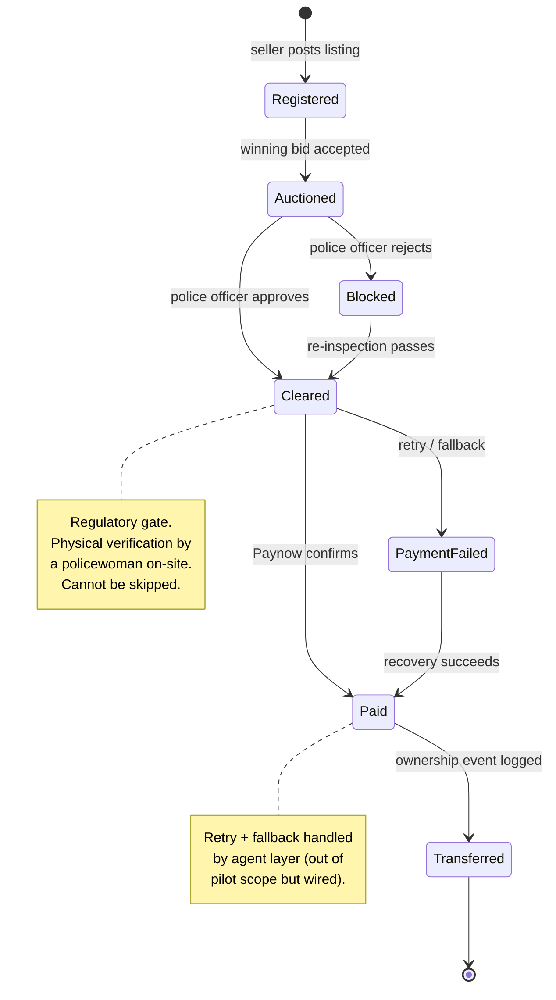
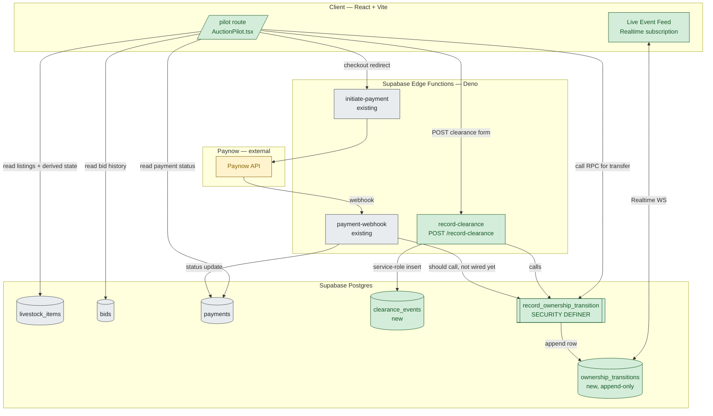
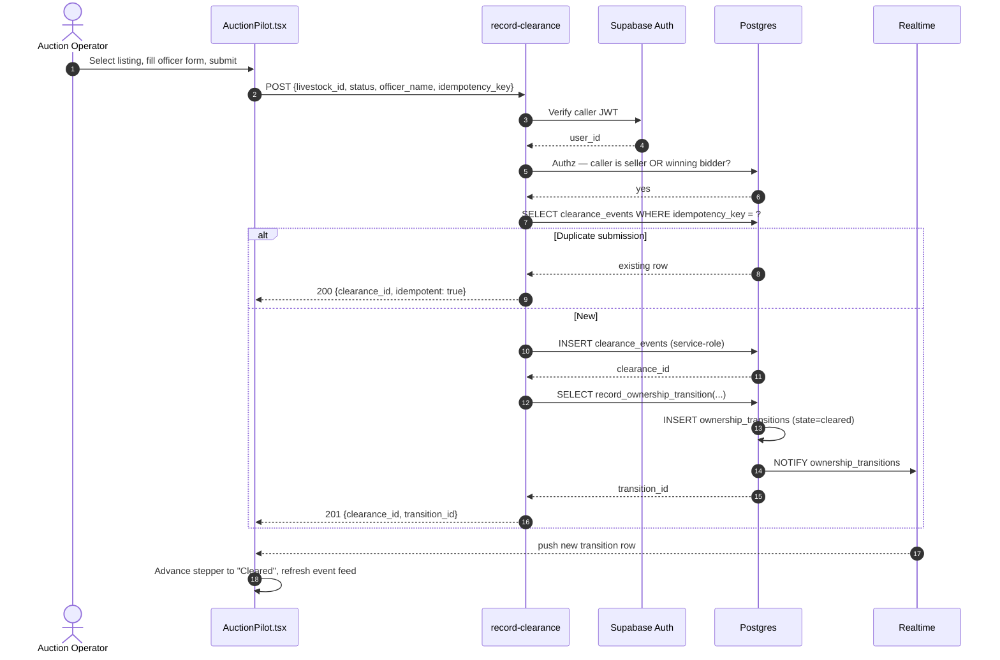
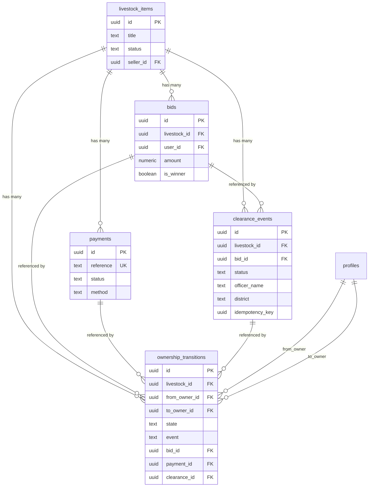

# Auction Pilot — Architecture

System-of-record scaffold for the five observed auction states. Built 2026-04-14 on branch `feature/auction-pilot-v2`. Pitch surface for auction-operator outreach.

Not a livestock app. A transactional audit trail of physical asset ownership changes.

---

## 1. State machine

The five states observed at a physical auction (Harare, 2026-03-19 field visit), instrumented as first-class.

---

## 2. Component architecture

**Legend:** green = built in this pilot · grey = pre-existing · yellow = external.

**Known gap:** `payment-webhook` does not yet call `record_ownership_transition` on a successful payment confirmation — the `paid` state transition is currently logged client-side from the pilot page. Server-side wiring is the next commit.

---

## 3. Clearance sequence (single event, happy path)

---

## 4. Schema relationships

---

## 5. Trust & authorization model

| Write path | Who can write | Enforcement |
|---|---|---|
| `clearance_events` insert | Service role only (via `record-clearance` edge function) | RLS — no INSERT policy for authenticated users |
| `ownership_transitions` insert | Service role OR `record_ownership_transition` RPC | RLS + RPC authorization (caller must be from_owner, to_owner, or seller) |
| `livestock_items` / `bids` / `payments` | Existing policies (unchanged) | Pre-existing RLS |

| Read path | Who can read | Enforcement |
|---|---|---|
| `clearance_events` | Seller of referenced listing OR winning bidder | RLS SELECT policy |
| `ownership_transitions` | Named from_owner / to_owner / seller | RLS SELECT policy |
| Realtime subscription | Same as SELECT (RLS applies to Realtime) | Supabase RLS-aware Realtime |

**Hard invariants:**
- No `stack` field in error responses (leak P0 from April 14 audit — prevented).
- Malformed JSON → 400, not 500 (SEV-1 fix from commit `567fcee` — preserved).
- No CORS wildcard (SEV-1 fix from commit `921bc62` — preserved).
- Idempotency key on `clearance_events` prevents double-submit (matches pattern on `bids` and `payments`).

---

## 6. What this is and is not

**Is:**
- A system-of-record for the physical auction → settlement → ownership flow.
- Append-only, auditable, party-scoped.
- Demo scaffold — proves the state machine is instrumentable, not that the business is operational.

**Is not:**
- A production marketplace.
- A replacement for the auction operator.
- Multi-PSP yet (Paynow only — second rail is a validation requirement, not a scaling one).
- Registrar of record for the Zimbabwe Department of Veterinary Services (regulatory integration is out of scope — regulation sits as a probabilistic filter with discretionary enforcement, captured as an attribute not a gate).

---

## 7. Open wiring (known gaps)

1. `payment-webhook` → `record_ownership_transition(state='paid')` — currently logged client-side; needs server-side call on confirmed webhook.
2. Second executor for true dependency inversion — Pesepay or Flutterwave stub so authorship claim holds.
3. Transport/logistics layer — field research flagged this as the next adjacent state (physical custody handoff). Out of pilot scope, noted for phase 2.
4. Veterinary certification integration — regulatory layer to be modeled as optional state attribute, not mandatory gate.

---

## 8. Related artifacts

- [deliverables/week-5/direction-analysis-2026-04-14.md](../deliverables/week-5/direction-analysis-2026-04-14.md) — VC-style direction analysis and why auction-operator-as-root-of-truth was selected.
- [AGENTIC.md](../AGENTIC.md) — the broader agent infrastructure demo (parallel pitch to Paynow).
- [supabase/schema.sql](../supabase/schema.sql#L720) (lines 720+) — schema source.
- [supabase/functions/record-clearance/index.ts](../supabase/functions/record-clearance/index.ts) — clearance event writer.
- [src/app/components/AuctionPilot.tsx](../src/app/components/AuctionPilot.tsx) — pilot page + event feed.
